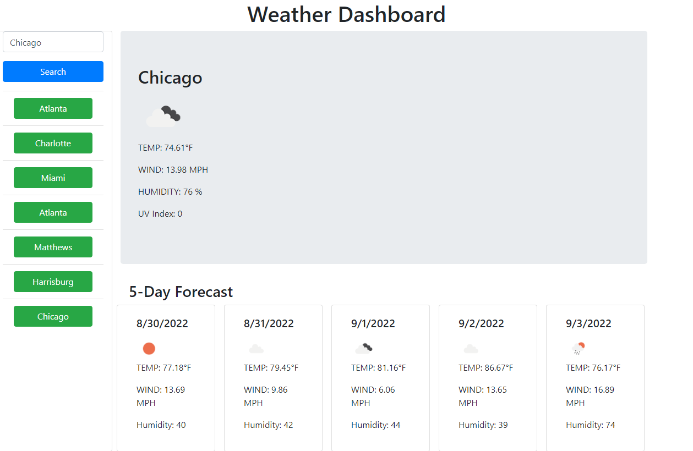

# weather-dashboard
## Table of Contents

* [Description](#description)
* [Visuals](#visuals)
* [Link](#link-to-site)

## Description
04-JavaScript

Using JavaScript and some html, I created and styled a weather dashboard that displays current weather information and a 5 day projection. I accomplished this by using the openweathermap api that provided the infomation needed to fill in the info. Then page allows the user to type the name of the city and search for the relevant weather information. The page also stores previous querys using locale storage. 

## Visuals

## Link to Site
[https://supernaldeity.github.io/weather-dashboard/]